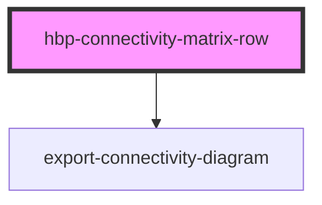
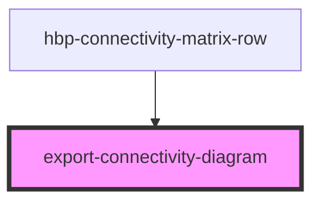

# HBP Connectivity browser component

HBP connectivity component is component 
*built with [StencilJS](https://stenciljs.com/)* to display and 
export connectivity matrix. 
There are 2 base components.
1. hbp-connectivity-matrix-row - too see connectivity of single source region in the form of diagram.
2. export-connectivity-diagram - too export connectivity data. Component is automatically imported in 
"hbp-connectivity-matrix-row" and to enable it set "show-export="true"" in "hbp-connectivity-matrix-row"

### Example of using component

    <hbp-connectivity-matrix-row -> Create component
            region="region name" -> Set source region name 
            theme="light" -> Set theme (There are 2 light and dark themes. default theme is dark.)
            loadurl="https://example.com" -> Set source url of connectivity data (It will hardcoded in component soon)
            show-export="true" -> Show export area
            show-source="true" -> Show source component
            show-title="true" -> Show title
            show-toolbar="true"> -> Show toolbar ("log10", "show all results"...)  
            customDatasetSelector="true" -> Enable custom dataset and show dataset details
            customHeight="100px" -> Set custom height of component
            customWidth="100px" -> Set custom width of component        
            datasetUrl="https://example.com" -> Set dataset url to get details about dataset"             
            showDatasetName="true" -> Show Dataset name
            show-description="true" -> Show Dataset description
        

 -> Send HTML to set custom header
        

 -> Sent HTML to set any content under connected area after user clicks
    </hbp-connectivity-matrix-row>
    

    
    
## Import component in your application
### Angular 2+ application
1. Install npm package - 

       npm install hbp-connectivity-component --save
       
2. Import "CUSTOM_ELEMENTS_SCHEMA" from angular core to main module of application
      
       import { NgModule, CUSTOM_ELEMENTS_SCHEMA } from "@angular/core";

3. Add "CUSTOM_ELEMENTS_SCHEMA" in schemas in main module

       schemas: [CUSTOM_ELEMENTS_SCHEMA]
       
3. Import "defineCustomElements" from "hbp-connectivity-component/dist/loader" into main.ts file
      main.ts
      
       import {defineCustomElements} from 'hbp-connectivity-component/dist/loader'
       
       
4. Use "defineCustomElements" in main.ts file              
      main.ts
      
       defineCustomElements(window) 

5. Done! component is available in application you can use it with tag:
       
       <hbp-connectivity-matrix-row></hbp-connectivity-matrix-row>

#API

## hbp-connectivity-matrix-row

<!-- Auto Generated Below -->

### Properties

| Property                | Attribute                 | Description | Type     | Default                                |
| ----------------------- | ------------------------- | ----------- | -------- | -------------------------------------- |
| `customDatasetSelector` | `custom-dataset-selector` | Show dataset info if dataset selector is enabled | `string` | `''`|
| `customHeight`          | `custom-height`           | Set custom height (Component will dynamically re-render on attribute change)| `string` | `''`|
| `customWidth`           | `custom-width`            | Set custom width (Component will dynamically re-render on attribute change)| `string` | `''`|
| `datasetUrl`            | `dataset-url`             | Set URL to get dataset info| `string` | `''`|
| `loadurl`               | `loadurl`                 | Set URL to load connectivity data| `string` | `''`|
| `region`                | `region`                  | Set source region of connectivity (Component will dynamically re-render on attribute change) | `string` | `''`|
| `showDatasetName`       | `show-dataset-name`       | Show dataset name (Set 'true' to enable) | `string` | `''`|
| `showDescription`       | `show-description`        | Show dataset description (Set 'true' to enable) | `string` | `''`|
| `showExport`            | `show-export`             | Show connectivity export panel (Set 'true' to enable) | `string` | `''` |
| `showSource`            | `show-source`             | Show source region name (Set 'true' to enable) | `string` | `''` |
| `showTitle`             | `show-title`              | Show title (Set 'true' to enable) | `string` | `''` |
| `showToolbar`           | `show-toolbar`            | Show toolbar (Set 'true' to enable) (toolbar contains checkbox to show logarithmic data and show all results on diagram) | `string` | `''`|
| `theme`                 | `theme`                   | Set theme ('dark' or 'light') (Component will dynamically re-render on attribute change)| `string` | `''` |

### Events

| Event                      | Description | Type               |
| -------------------------- | ----------- | ------------------ |
| `collapsedMenuChanged`     | Event emits on connected area mouse click | `CustomEvent<any>` |
| `connectivityDataReceived` | Event emits when connectivity data will initialized | `CustomEvent<any>` |
| `datasetDataReceived`      | Event emits when dataset information will initialized | `CustomEvent<any>` |

### Dependencies

#### Depends on

- [export-connectivity-diagram](../export-connectivity-diagram)

#### Graph

----------------------------------------------

## export-connectivity-diagram component

<!-- Auto Generated Below -->

### Properties

| Property         | Attribute         | Description | Type     |
| ---------------- | ----------------- | ----------- | -------- |
| `connectedAreas` | `connected-areas` | Connected areas to export as csv | `any`    |
| `el`             | `el`              | element to export as png | `any`    |
| `theme`          | `theme`           | Set theme ('dark' or 'light') | `string` |

### Methods

#### `downloadPng() => Promise<void>`

##### Returns

Type: `Promise<void>`

#### `getCSVData() => Promise<unknown>`

##### Returns

Type: `Promise<unknown>`

### Dependencies

#### Used by

 - [hbp-connectivity-matrix-row](../hbp-connectivity-matrix-row)

#### Graph

----------------------------------------------
