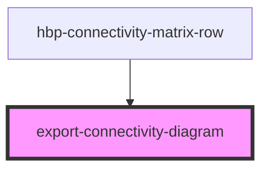

# export-connectivity-diagram

<!-- Auto Generated Below -->

## Properties

| Property         | Attribute         | Description | Type     | Default     |
| ---------------- | ----------------- | ----------- | -------- | ----------- |
| `connectedAreas` | `connected-areas` |             | `any`    | `undefined` |
| `datasetInfo`    | `dataset-info`    |             | `any`    | `undefined` |
| `el`             | `el`              |             | `any`    | `undefined` |
| `hideView`       | `hide-view`       |             | `string` | `undefined` |
| `theme`          | `theme`           |             | `string` | `undefined` |

## Methods

### `downloadCSV() => Promise<void>`

#### Returns

Type: `Promise<void>`

### `downloadPng() => Promise<void>`

#### Returns

Type: `Promise<void>`

### `getCSVData() => Promise<unknown>`

#### Returns

Type: `Promise<unknown>`

## Dependencies

### Used by

 - [hbp-connectivity-matrix-row](../hbp-connectivity-matrix-row)

### Graph

----------------------------------------------

*Built with [StencilJS](https://stenciljs.com/)*
