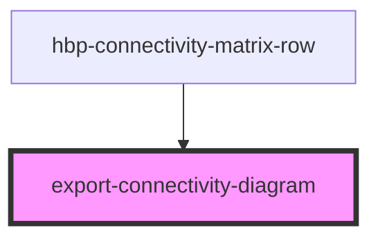

# export-connectivity-diagram

<!-- Auto Generated Below -->

## Properties

| Property         | Attribute         | Description | Type     |
| ---------------- | ----------------- | ----------- | -------- |
| `connectedAreas` | `connected-areas` | Connected areas to export as csv | `any`    |
| `el`             | `el`              | element to export as png | `any`    |
| `theme`          | `theme`           | Set theme ('dark' or 'light') | `string` |

## Methods

### `downloadPng() => Promise<void>`

#### Returns

Type: `Promise<void>`

### `getCSVData() => Promise<unknown>`

#### Returns

Type: `Promise<unknown>`

## Dependencies

### Used by

 - [hbp-connectivity-matrix-row](../hbp-connectivity-matrix-row)

### Graph

----------------------------------------------
