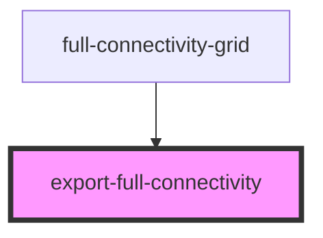

# export-full-connectivity

<!-- Auto Generated Below -->

## Properties

| Property      | Attribute      | Description | Type  | Default     |
| ------------- | -------------- | ----------- | ----- | ----------- |
| `connections` | `connections`  |             | `any` | `undefined` |
| `datasetInfo` | `dataset-info` |             | `any` | `undefined` |

## Methods

### `downloadFUllConnectivityCsv() => Promise<void>`

#### Returns

Type: `Promise<void>`

### `getFullConnectivityCSVData() => Promise<unknown>`

#### Returns

Type: `Promise<unknown>`

## Dependencies

### Used by

 - [full-connectivity-grid](../full-connectivity-grid)

### Graph

----------------------------------------------

*Built with [StencilJS](https://stenciljs.com/)*
