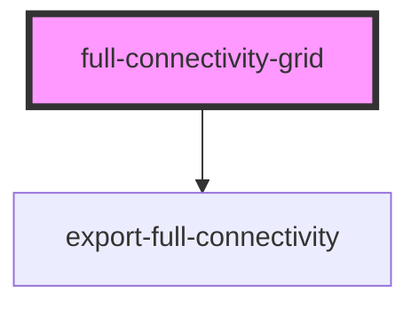

# full-connectivity-grid

<!-- Auto Generated Below -->

## Properties

| Property        | Attribute        | Description | Type     | Default  |
| --------------- | ---------------- | ----------- | -------- | -------- |
| `datasetUrl`    | `dataset-url`    |             | `string` | `''`     |
| `gridheight`    | `gridheight`     |             | `string` | `'auto'` |
| `gridwidth`     | `gridwidth`      |             | `string` | `'auto'` |
| `loadurl`       | `loadurl`        |             | `string` | `''`     |
| `onlyExport`    | `only-export`    |             | `string` | `''`     |
| `pixelsize`     | `pixelsize`      |             | `number` | `10`     |
| `textwidth`     | `textwidth`      |             | `number` | `70`     |
| `theme`         | `theme`          |             | `string` | `''`     |
| `tooltipHeight` | `tooltip-height` |             | `number` | `90`     |
| `tooltipWidth`  | `tooltip-width`  |             | `number` | `250`    |

## Events

| Event                      | Description | Type               |
| -------------------------- | ----------- | ------------------ |
| `connectivityDataReceived` |             | `CustomEvent<any>` |

## Methods

### `downloadCSV() => Promise<void>`

#### Returns

Type: `Promise<void>`

## Dependencies

### Depends on

- [export-full-connectivity](../export-full-connectivity)

### Graph

----------------------------------------------

*Built with [StencilJS](https://stenciljs.com/)*
