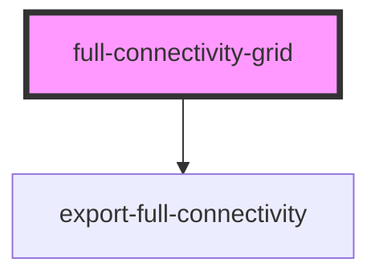

# full-connectivity-grid

<!-- Auto Generated Below -->

## Properties

| Property     | Attribute     | Description | Type     | Default  |
| ------------ | ------------- | ----------- | -------- | -------- |
| `datasetUrl` | `dataset-url` |             | `string` | `''`     |
| `gridheight` | `gridheight`  |             | `string` | `'100%'` |
| `gridwidth`  | `gridwidth`   |             | `string` | `'100%'` |
| `onlyExport` | `only-export` |             | `string` | `''`     |
| `pixelsize`  | `pixelsize`   |             | `string` | `'8px'`  |
| `textwidth`  | `textwidth`   |             | `string` | `'70px'` |
| `theme`      | `theme`       |             | `string` | `''`     |

## Events

| Event                      | Description | Type               |
| -------------------------- | ----------- | ------------------ |
| `connectivityDataReceived` |             | `CustomEvent<any>` |

## Methods

### `downloadCSV() => Promise<void>`

#### Returns

Type: `Promise<void>`

## Dependencies

### Depends on

- [export-full-connectivity](../export-full-connectivity)

### Graph

----------------------------------------------

*Built with [StencilJS](https://stenciljs.com/)*
