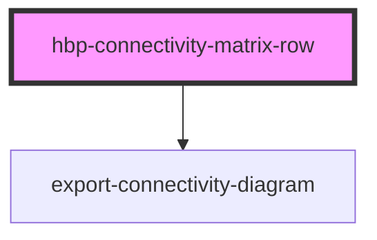

# hbp-connectivity-matrix-row

<!-- Auto Generated Below -->

## Properties

| Property          | Attribute          | Description | Type     | Default     |
| ----------------- | ------------------ | ----------- | -------- | ----------- |
| `loadurl`         | `loadurl`          |             | `string` | `undefined` |
| `region`          | `region`           |             | `string` | `undefined` |
| `showDescription` | `show-description` |             | `string` | `undefined` |
| `showExport`      | `show-export`      |             | `string` | `undefined` |
| `showSource`      | `show-source`      |             | `string` | `undefined` |
| `showTitle`       | `show-title`       |             | `string` | `undefined` |
| `showToolbar`     | `show-toolbar`     |             | `string` | `undefined` |
| `theme`           | `theme`            |             | `string` | `undefined` |

## Events

| Event                      | Description | Type               |
| -------------------------- | ----------- | ------------------ |
| `collapsedMenuChanged`     |             | `CustomEvent<any>` |
| `connectivityDataReceived` |             | `CustomEvent<any>` |

## Dependencies

### Depends on

- [export-connectivity-diagram](../export-connectivity-diagram)

### Graph

----------------------------------------------

*Built with [StencilJS](https://stenciljs.com/)*
