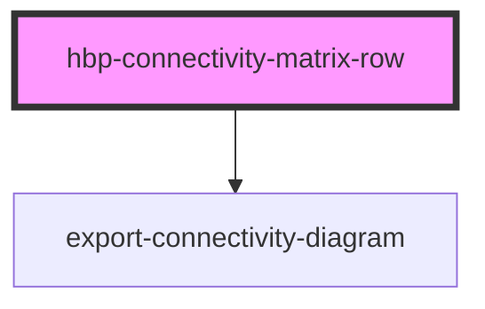

# hbp-connectivity-matrix-row API

<!-- Auto Generated Below -->

## Properties

| Property                | Attribute                 | Description | Type     | Default                                |
| ----------------------- | ------------------------- | ----------- | -------- | -------------------------------------- |
| `customDatasetSelector` | `custom-dataset-selector` | Show dataset info if dataset selector is enabled | `string` | `''`|
| `customHeight`          | `custom-height`           | Set custom height (Component will dynamically re-render on attribute change)| `string` | `''`|
| `customWidth`           | `custom-width`            | Set custom width (Component will dynamically re-render on attribute change)| `string` | `''`|
| `datasetUrl`            | `dataset-url`             | Set URL to get dataset info| `string` | `''`|
| `loadurl`               | `loadurl`                 | Set URL to load connectivity data| `string` | `''`|
| `region`                | `region`                  | Set source region of connectivity (Component will dynamically re-render on attribute change) | `string` | `''`|
| `showDatasetName`       | `show-dataset-name`       | Show dataset name (Set 'true' to enable) | `string` | `''`|
| `showDescription`       | `show-description`        | Show dataset description (Set 'true' to enable) | `string` | `''`|
| `showExport`            | `show-export`             | Show connectivity export panel (Set 'true' to enable) | `string` | `''` |
| `showSource`            | `show-source`             | Show source region name (Set 'true' to enable) | `string` | `''` |
| `showTitle`             | `show-title`              | Show title (Set 'true' to enable) | `string` | `''` |
| `showToolbar`           | `show-toolbar`            | Show toolbar (Set 'true' to enable) (toolbar contains checkbox to show logarithmic data and show all results on diagram) | `string` | `''`|
| `theme`                 | `theme`                   | Set theme ('dark' or 'light') (Component will dynamically re-render on attribute change)| `string` | `''` |

## Events

| Event                      | Description | Type               |
| -------------------------- | ----------- | ------------------ |
| `collapsedMenuChanged`     | Event emits on connected area mouse click | `CustomEvent<any>` |
| `connectivityDataReceived` | Event emits when connectivity data will initialized | `CustomEvent<any>` |
| `datasetDataReceived`      | Event emits when dataset information will initialized | `CustomEvent<any>` |

## Dependencies

### Depends on

- [export-connectivity-diagram](../export-connectivity-diagram)

### Graph

----------------------------------------------