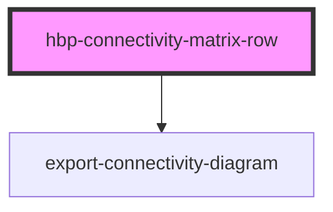

# hbp-connectivity-matrix-row

<!-- Auto Generated Below -->

## Properties

| Property                | Attribute                 | Description | Type     | Default                                |
| ----------------------- | ------------------------- | ----------- | -------- | -------------------------------------- |
| `customDatasetSelector` | `custom-dataset-selector` |             | `string` | `''`                                   |
| `customHeight`          | `custom-height`           |             | `string` | `''`                                   |
| `customWidth`           | `custom-width`            |             | `string` | `''`                                   |
| `datasetUrl`            | `dataset-url`             |             | `string` | `''`                                   |
| `loadurl`               | `loadurl`                 |             | `string` | `''`                                   |
| `region`                | `region`                  |             | `string` | `'Area 4a (PreCG) - right hemisphere'` |
| `showDatasetName`       | `show-dataset-name`       |             | `string` | `''`                                   |
| `showDescription`       | `show-description`        |             | `string` | `''`                                   |
| `showExport`            | `show-export`             |             | `string` | `''`                                   |
| `showSource`            | `show-source`             |             | `string` | `''`                                   |
| `showTitle`             | `show-title`              |             | `string` | `''`                                   |
| `showToolbar`           | `show-toolbar`            |             | `string` | `''`                                   |
| `theme`                 | `theme`                   |             | `string` | `''`                                   |

## Events

| Event                      | Description | Type               |
| -------------------------- | ----------- | ------------------ |
| `collapsedMenuChanged`     |             | `CustomEvent<any>` |
| `connectivityDataReceived` |             | `CustomEvent<any>` |
| `datasetDataReceived`      |             | `CustomEvent<any>` |

## Dependencies

### Depends on

- [export-connectivity-diagram](../export-connectivity-diagram)

### Graph

----------------------------------------------

*Built with [StencilJS](https://stenciljs.com/)*
