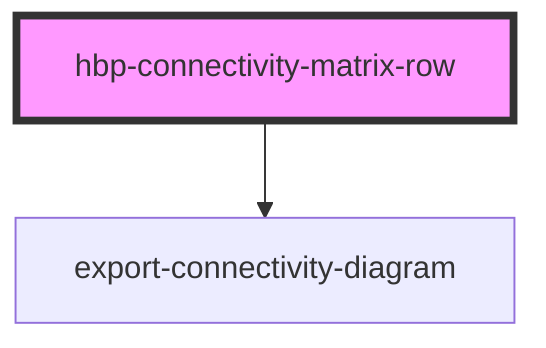

# hbp-connectivity-matrix-row

<!-- Auto Generated Below -->

## Properties

| Property          | Attribute           | Description | Type     | Default                                                                 |
| ----------------- | ------------------- | ----------- | -------- | ----------------------------------------------------------------------- |
| `datasetUrl`      | `dataset-url`       |             | `string` | `'https://connectivityquery-connectivity.apps-dev.hbp.eu/studies'`      |
| `loadurl`         | `loadurl`           |             | `string` | `'https://connectivityquery-connectivity.apps-dev.hbp.eu/connectivity'` |
| `region`          | `region`            |             | `string` | `'Area 4a (PreCG) - right hemisphere'`                                  |
| `showDatasetName` | `show-dataset-name` |             | `string` | `'true'`                                                                |
| `showDescription` | `show-description`  |             | `string` | `'true'`                                                                |
| `showExport`      | `show-export`       |             | `string` | `'true'`                                                                |
| `showSource`      | `show-source`       |             | `string` | `'true'`                                                                |
| `showTitle`       | `show-title`        |             | `string` | `'false'`                                                               |
| `showToolbar`     | `show-toolbar`      |             | `string` | `'true'`                                                                |
| `theme`           | `theme`             |             | `string` | `'dark'`                                                                |

## Events

| Event                      | Description | Type               |
| -------------------------- | ----------- | ------------------ |
| `collapsedMenuChanged`     |             | `CustomEvent<any>` |
| `connectivityDataReceived` |             | `CustomEvent<any>` |

## Dependencies

### Depends on

- [export-connectivity-diagram](../export-connectivity-diagram)

### Graph

----------------------------------------------

*Built with [StencilJS](https://stenciljs.com/)*
